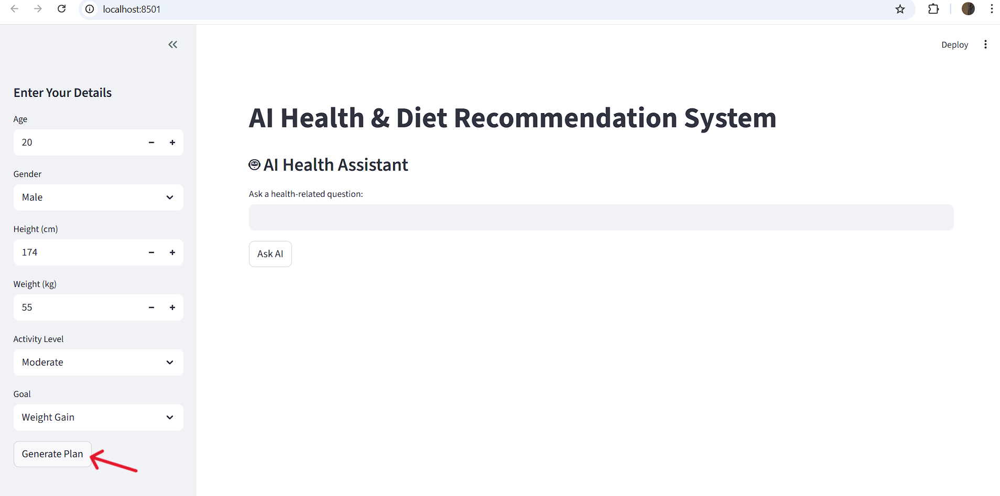
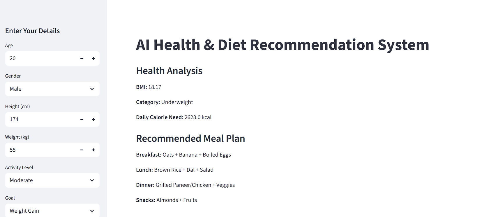

# 🧠 AI Health & Diet Recommendation System

An AI-powered web application that provides personalized health analysis and diet recommendations using Machine Learning and LLM integration.

---

## 🚀 Project Overview

This system combines traditional Machine Learning with Large Language Model (LLM) integration to deliver intelligent health recommendations.

It calculates BMI, predicts daily calorie requirements using a Random Forest model, and includes an AI-powered health assistant chatbot.

---

## ✨ Key Features

- 📊 BMI Calculation & Health Classification  
- 🤖 Machine Learning-based Calorie Prediction (Random Forest)  
- 🍽 Personalized Diet Recommendations  
- 💬 AI Health Assistant Chatbot (LLM Integration)  
- 🔐 Secure API Key Handling using .env  
- 🗂 Modular Project Structure  

---

## 🛠 Tech Stack

- Python  
- Streamlit  
- Scikit-learn  
- Random Forest  
- OpenRouter API  
- python-dotenv  
- Git & GitHub  

---

## 📦 How to Run

1. Clone the repository:

   git clone https://github.com/raza242k5-sys/AI-Health-Diet-System.git

2. Install dependencies:

   pip install -r requirements.txt

3. Create `.env` file:

   OPENROUTER_API_KEY=your_api_key_here

4. Run:

   streamlit run app.py

---

## 🎯 Learning Outcomes

- Built ML prediction system  
- Integrated LLM API  
- Implemented secure environment variables  
- Structured modular Python project 

---

## 📸 Screenshots

### 🏠 Dashboard

---

### 📊 Health Analysis & Calorie Prediction

---

### 💬 AI Chatbot

---

## 👨‍💻 Author

**Raza Rahman**  
Computer Engineering Student | AI & Machine Learning Enthusiast  

🔗 GitHub: https://github.com/raza242k5-sys  
🔗 LinkedIn: https://linkedin.com/in/razarahman245

