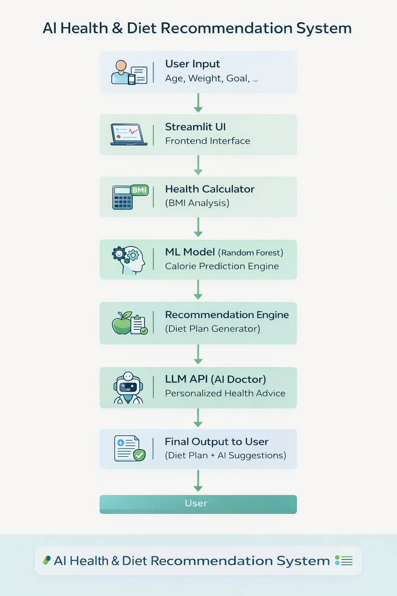
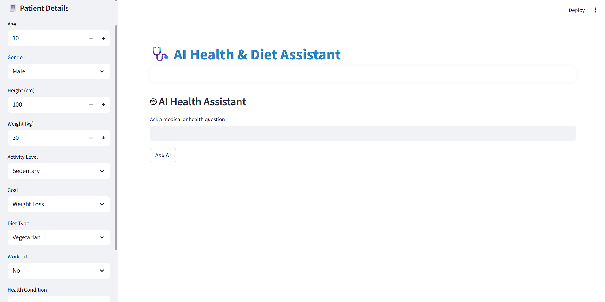
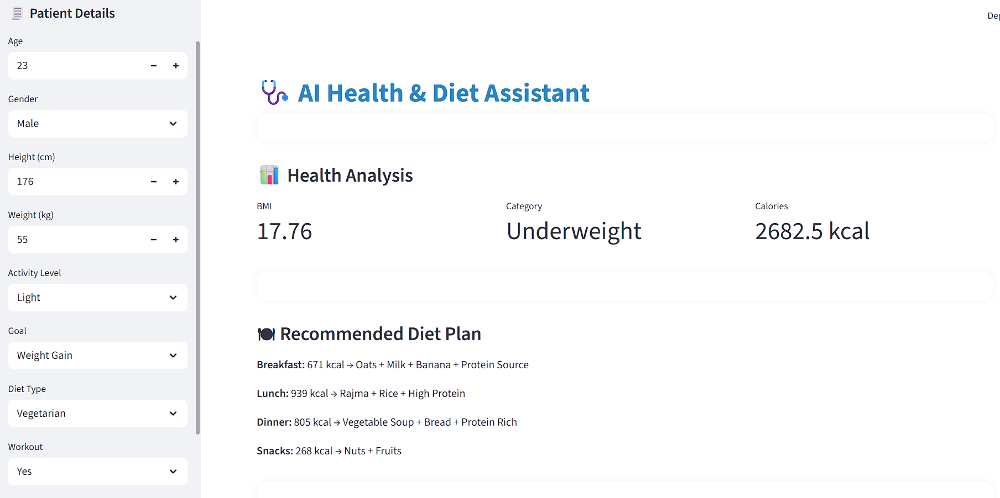
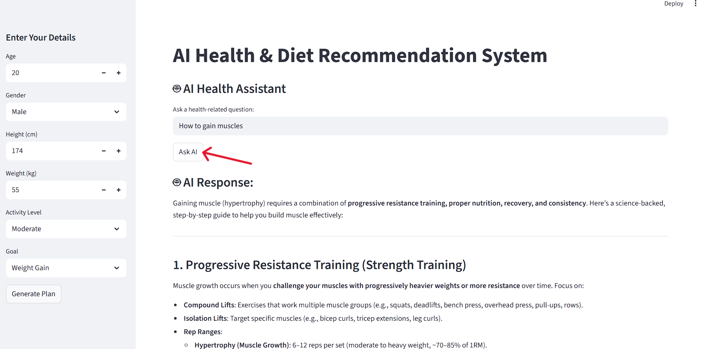

# 🩺 AI Health & Diet Recommendation System

An intelligent healthcare web application that combines **Machine Learning + LLM (AI Chatbot)** to provide personalized diet plans, calorie prediction, and smart health guidance.

🚀 Built using Machine Learning + LLM integration to simulate a real-world AI healthcare assistant.

---

## 🚀 Features

### 🧠 Health Analysis
- BMI Calculation
- Health Category Classification
- Daily Calorie Prediction using ML model

### 🍽 Smart Diet Recommendation
- Personalized meal plan based on:
  - Goal (Weight Loss / Gain / Maintain)
  - Calories
  - Diet Type (Veg / Non-Veg)
  - Gym Activity
  - Health Conditions (Diabetes, Heart)

### 🤖 Personal AI Doctor (LLM)
- Uses OpenRouter API
- Gives **personalized health advice**
- Considers:
  - BMI
  - Calories
  - Goal
  - Disease
  - Lifestyle

### 📈 Progress Tracking
- Weekly weight progress visualization

---

## 🧠 Model Overview

The system uses a **Random Forest Regressor** for calorie prediction.

### 🔍 Features Used:
- Age  
- Gender  
- Height  
- Weight  
- Activity Level  
- Goal  

### ⚙ Approach:
- Label Encoding for categorical features  
- Model trained on full dataset (due to limited synthetic data)  
- Real-time prediction integrated with UI  

---

## 🏗 System Architecture


---

## 🛠 Tech Stack

### 💻 Language
- Python

### 🌐 Framework
- Streamlit

### 🤖 Machine Learning
- scikit-learn (Random Forest)

### 📊 Data Handling
- pandas, numpy

### 🔗 API
- OpenRouter (LLM API)

### 🔐 Security
- python-dotenv (.env for API keys)

---

## 📸 Screenshots

### 🏠 Dashboard


### 📊 Health Analysis


### 🤖 AI Chatbot


---

## ⚙️ How to Run

### 1️⃣ Clone Repository
```bash
git clone https://github.com/raza242k5-sys/AI-Health-Diet-System.git
cd AI-Health-Diet-System
```

### 2️⃣ Install Dependencies
```bash
pip install -r requirements.txt
```

### 3️⃣ Add API Key

Create `.env` file:

```env
OPENROUTER_API_KEY=your_api_key_here
```

### 4️⃣ Run App
```bash
streamlit run app.py
```

---

## 🔐 Important
- Do NOT upload `.env` file to GitHub  
- Keep API key secure  

---

## 💡 Future Improvements
- User login & history tracking  
- Database integration  
- PDF health report generation  
- Deep learning food recognition  
- Real-time fitness tracking  

---

## 👨‍💻 Author

**Raza Ur Rahman**  
Computer Engineering Student  
AI Developer  

🔗 [GitHub](https://github.com/raza242k5-sys)  
🔗 [LinkedIn](https://linkedin.com/in/razarahman242k5)